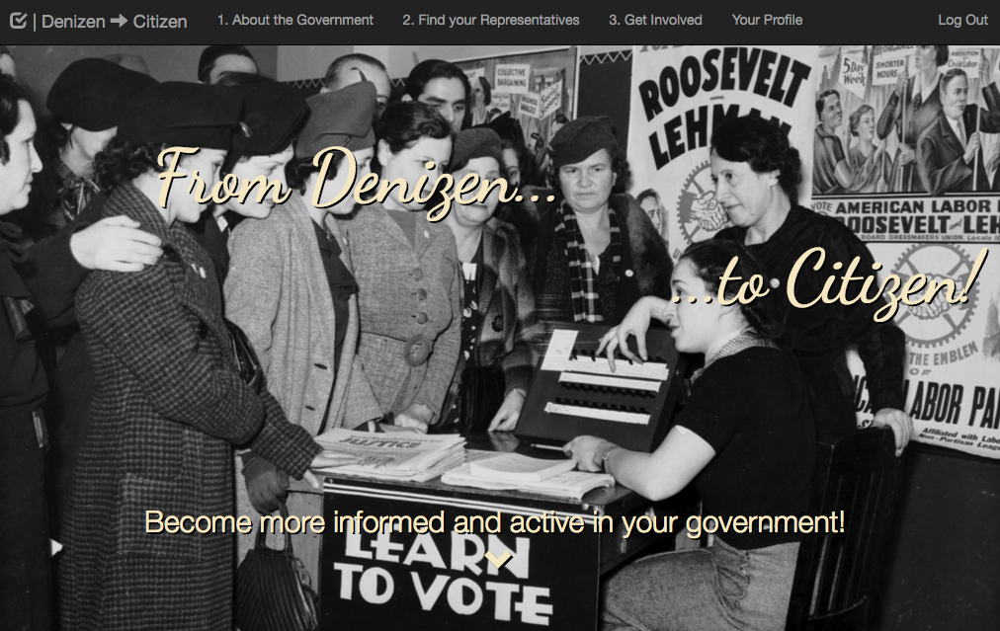

# Denizen to Citizen
### Become more informed and active in your government!

## About
This is serves as an access portal for someone of little to no political knowledge to get started on being a constructive citizen. It'll let someone know the basics of how the government works, how they fit into the picture, and highlight resources they can use to further their understanding.

You can see this app in action [here](https://constructive-citizen.herokuapp.com/).

Main Goals:
The biggest problems with the politic process is either apathy or not knowing how to be involved.

This application seeks to make it easy to find out how the government works.

A user can find out who represents them at various levels of the government and how to contact them.

You can also look up election information in your state or area

You can find the resources on how to register to vote and where you need to go in your area

After logging in, you can create reminders to keep track of deadlines, elections, or other important dates.

## Requirements
To use this locally, you will need access to your terminal.
You will also need NPM, MongoDB, and Redis-server

## Installing
1. In the directory you want to install, Git Clone this repo
2. Change Directory into the cloned repo
3. In that main directory run `npm install`
4. Make sure that MongoDB is installed and running
5. In order to have login functionality you will need to install redis-server installed and running

## Running
1. Once install is complete run `npm start`
2. Open a browser tab to http://localhost:3000/

## Usage

To use the deployed online version [click here](https://constructive-citizen.herokuapp.com/), it may take a little bit to load depending on how long since the last user accessed it.

## Future Plans
Next Steps:

