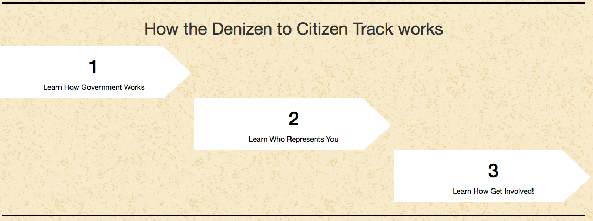
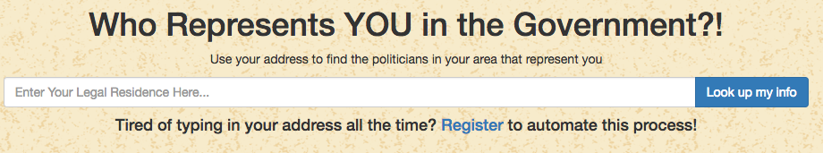
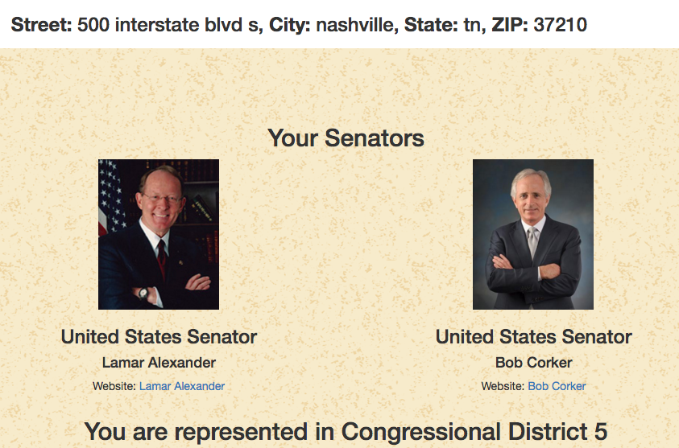
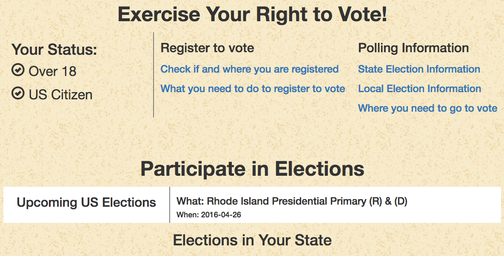
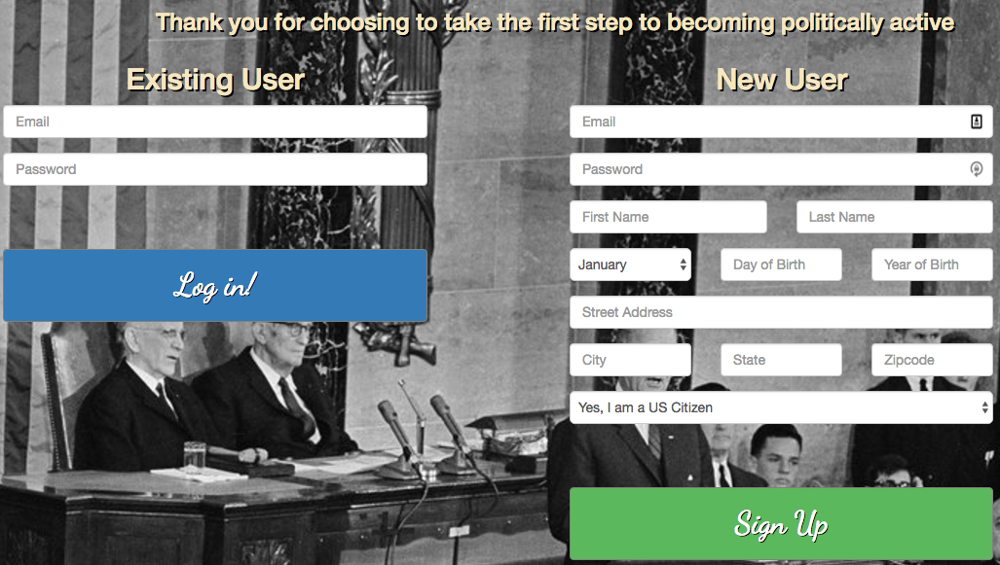
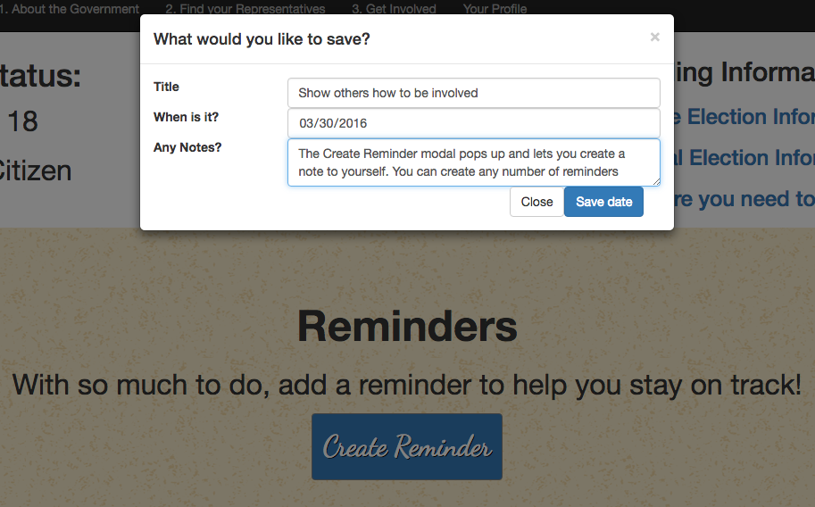

# Denizen to Citizen

### Become more informed and active in your government!

## About
This is serves as an access portal for someone of little to no political knowledge to get started on being a constructive citizen. It'll let someone know the basics of how the government works, how they fit into the picture, and highlight resources they can use to further their understanding.

You can see this app in action [here](https://constructive-citizen.herokuapp.com/).

Main Goals:
The biggest problems with the politic process is either apathy or not knowing how to be involved.

This application seeks to make it easy to find out how the government works.

A user can find out who represents them at various levels of the government and how to contact them.

You can also look up election information in your state or area

You can find the resources on how to register to vote and where you need to go in your area

After logging in, you can create reminders to keep track of deadlines, elections, or other important dates.

## Requirements
To use this locally, you will need access to your terminal.
You will also need NPM, MongoDB, and Redis-server

## Installing
1. In the directory you want to install, Git Clone this repo
2. Change Directory into the cloned repo
3. In that main directory run `npm install`
4. Make sure that MongoDB is installed and running
5. In order to have login functionality you will need to install redis-server installed and running

## Running
1. Once install is complete run `npm start`
2. Open a browser tab to http://localhost:3000/

## Usage

To use the deployed online version [click here](https://constructive-citizen.herokuapp.com/), it may take a little bit to load depending on how long since the last user accessed it.

There are three main actions for a new user or guest.

1. Learning about the government,  2. Finding your representatives,  3. Looking up election info

These are navigated to from the index page or the navbar at the top of screen.

For election info or representatives a user will need to type in their address into the search prompt. The street address is the most important part, depending on how unique the street is the city or state may also be required.

The website will load the search results below and show the exact address it searched for (in case you need to refine your terms).

For the representatives it starts at the Federal level, then the State level, etc.

For the election info it displays your voting status (based on age and citizenship). Other state based requirements may be applicable, and so links to various sites that allow you to check your registration status and requirements are provided.

A user can also sign up for their own account. This will store their address so they don't have to type it in every time. This address can be changed on the profile page.

Also on the profile page, in addition to the your voting status and helpful links, is the ability to set reminders and create your own plan of action in order to stay on top of the political process.

## Future Plans
Next Steps:
Cultivating a more complete lesson plan for how the government works would fill out the information section more.

There are some issues with error handling of bad addresses

Local level information is harder to come by and can vary from state to state in structure (situations like the presence of a city council or county council)

Some of the information provided by the API is out of date or missing. I would like to team up with the local brigade of Code for Nashville in order to create a more accessible and complete API for the local level of government

I would like for different users to be able to find and communicate with each other, in order to share information and provide support

